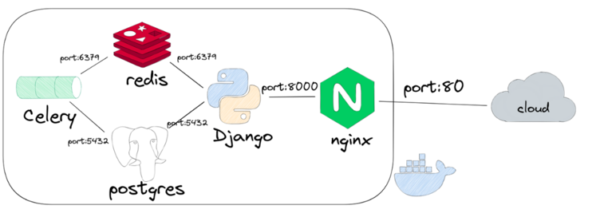

# ВК Бот для Школы программирования “КодингЦентр”

Разработали:

```
Исхаков Тимур - https://github.com/Timik2t,
Илья Лебедев - https://github.com/Lebedev-github,
Блусенков Александр - https://github.com/ablusenkov,
Терницкий Антон - https://github.com/A60874022,
Ляйсан Галиева - https://github.com/killyourasta,
Борис Кириллов - https://github.com/kbm-engineer,
Хомутов Евгений - https://github.com/Sambo312
```

Запус проекта включает в себя несколько основных этапов
<ol>
<li>Установка виртаульного окружение и необходимых зависимостей</li>
<li>Установка и подключение Celery</li>
<li>Запуск проекта</li>
</ol>

Также проект может быть развернут в виде микросервисов использую docker (cм. ниже)

### 1. Установка виртаульного окружение и необходимых зависимостей

Склонируйте репозиторий
```commandline
git clone https://github.com/Studio-Yandex-Practicum/coding_centre_3.git
cd coding_centre_3
```
В проекте мы полагаемся на классический venv.
```commandline
python3 -m venv venv
source venv/bin/activate
```
Обновляем pip
```bash
python -m pip install --upgrade pip
```
Устанавливаем зависимости
```commandline
pip install -r bot_project/requirements.txt
```
Получите ключ доступа к VK API, подробнее в [документации VK API](https://dev.vk.com/api/access-token/getting-started).

*Проекст работает с БД PostgreSQL, убедитесь, что PostgreSQL сервер работает на вашем хосте и использует порт 5432*

В корне проекта необходимо создать файл `.env`:
```bash
# Секретный ключ Django
DJANGO_KEY=my_secret_key

# Настройки базы данных PostgreSQL
DB_ENGINE='django.db.backends.postgresql'
DB_NAME='postgres'            # Имя базы данных
POSTGRES_USER='postgres'      # Имя пользователя базы данных
POSTGRES_PASSWORD='postgres'  # Пароль пользователя базы данных
DB_HOST='127.0.0.1'           # Адрес хоста базы данных
DB_PORT=5432                  # Порт для подключения к базе данных

# Настройки Redis
REDIS_HOST=127.0.0.1
REDIS_PORT=6379

# Ключ доступа к API VK и индентификатор группы, интервал для тестирования (секунды), интервал запуска задач (дни)
VK_API_TOKEN='my_vk_api_key'
VK_API_GROUP_ID='Индентификатор группы'
VK_API_QUIZ_RESPONSE_INTERVAL='Интервал перед следующим вопросом в тестировании'
VK_API_TASKS_INTERVAL='Интервал запуска периодических задач (маркетинговая рассылка, напоминания)'
```
### 2. Установка и подключение Celery

Для выполнения асинхронных задач в проекте используется Celery в связке с Redis. Следуйте этим шагам, чтобы настроить и запустить Celery:

**Шаг 1:** Установите и запустите Redis Server.

Инструкции по установке можно найти на официальном сайте Redis: https://redis.io/docs/getting-started/installation/

<details>
  <summary>Альтернатива для Windows (только для тестирования и отладки)</summary>
  <ol>
    <li>Скачайте дистрибутив Redis для Windows с официальной страницы  <a href="https://github.com/microsoftarchive/redis/releases">GitHub Microsoft Open Tech</a></li>
    <li>Разархивируйте скачанный файл в нужную вам папку на компьютере.</li>
    <li>Запустите `redis-server.exe`</li>
  </ol>
</details>

**Шаг 2:** Запустите Redis на локальной машине (пример для MacOS)

```commandline
brew services start redis
```

<details>
<summary>При запуске в терминале должен отобразится Successfully started `redis` статус</summary>

```commandline
brew services start redis
==> Tapping homebrew/services
Cloning into '/usr/local/Homebrew/Library/Taps/homebrew/homebrew-services'...
remote: Enumerating objects: 2462, done.
remote: Counting objects: 100% (283/283), done.
remote: Compressing objects: 100% (102/102), done.
remote: Total 2462 (delta 200), reused 206 (delta 181), pack-reused 2179
Receiving objects: 100% (2462/2462), 678.01 KiB | 1.65 MiB/s, done.
Resolving deltas: 100% (1139/1139), done.
Tapped 1 command (45 files, 847KB).
==> Successfully started `redis` (label: homebrew.mxcl.redis)
```
</details>

<details>
<summary>Ниже пример проверки статуса, остановки сервиса (пример для MacOS)</summary>

```commandline
brew services info redis

redis (homebrew.mxcl.redis)
Running: ✔
Loaded: ✔
Schedulable: ✘
User: your_username
PID: 39100
```


Остановка сервиса
```
brew services stop redis
Stopping `redis`... (might take a while)
==> Successfully stopped `redis` (label: homebrew.mxcl.redis)
```

Обратите внимание, если redis service не запущен, недостапен (локальный файрвол и тп), то при запуски Celery Worker вы будете видеть:

```commandline
...
[2023-07-20 17:13:11,860: ERROR/MainProcess] consumer: Cannot connect to redis://localhost:6379/0: Error 61 connecting to localhost:6379. Connection refused..
Trying again in 32.00 seconds... (16/100)
...
```

</details>


**Шаг 3:** Запустите Celery Worker и Celery Beat 

```
celery -A bot_project worker --beat --scheduler django --loglevel=info
```
Либо отдельными коммандами:
```
celery -A bot_project worker -l info
```
```
celery -A bot_project beat -l info
```

В результате, среди всего прочего, вы должны видеть, что подключение состоялось

```commandline
...
[2023-07-20 17:01:31,007: INFO/MainProcess] Connected to redis://localhost:6379/0
...
```
<!-- Если будем использовать в проекте миграции селери -->
Выполните миграции Celery, что бы создалась таблица в базе данных с именем `django_celery_results`. В этой таблице будут храниться результаты выполненных задач. Для каждой задачи будет создана запись с информацией о ее статусе, времени выполнения, результате и других метаданных.
```bash
python manage.py migrate django_celery_results
```
### 3. Запуск проекта

Запуск осуществляется по классической схеме django:
```commandline
python3 bot_project/manage.py runserver
```
Обратите внимание, что в процессе может понадобиться запустить миграции

```commandline
python3 bot_project/manage.py migrate
```
## Развертывание проекта в Docker

Проект предполагает возможность микросервисной архитектуры, где основные компоненты вынесены в отдельный сервис. Для наглядности, это выглядит следующим образом:




### Локальный запуск проекта
### 1. Убедитесь что docker и docker-compose установлены
### 2. Перейдите в директорию infra
```commandline
cd infra/dev
```
### 3. Задайте переменные окружение в .env (по аналогии с .env_example)
```
...
# Redis related configuration
REDIS_HOST=172.17.0.1
REDIS_PORT=6379

# POSTGRES-related variable and credentials
DB_ENGINE=django.db.backends.postgresql
DB_NAME=postgres
POSTGRES_USER=postgres
POSTGRES_PASSWORD=postgres
DB_HOST=db
DB_PORT=5432

# Selery-related variables
CELERY_BROKER_URL=redis://redis:6379/0
CELERY_RESULT_BACKEND=redis://redis:6379/0
...
```

Обратите внимание, что выше не показаны переменные окружения адресованные в settings.py

### 4. Разверните проект


```
docker-compose docker-compose.local.yaml up --build -d
```


В случае необходимости выполните миграции и/или определите суперпользователя используя следующие команды
```
docker-compose -f docker-compose.local.yaml exec backend python manage.py migrate
docker-compose -f docker-compose.local.yaml exec backend python manage.py collectstatic
docker-compose -f docker-compose.local.yaml exec backend python manage.py createsuperuser
```

### Развертывание проекта на удаленном сервере
Проект также подразумевает автоматическое развертывание на удаленном сервере.
<br>
В случае необходимости выполните миграции и/или определите суперпользователя используя следующие команды
```
cd ~/coding_centre_3/infra/dev
docker-compose -f docker-compose.stage.yaml exec backend python manage.py migrate
docker-compose -f docker-compose.stage.yaml exec backend python manage.py collectstatic
docker-compose -f docker-compose.stage.yaml exec backend python manage.py createsuperuser
```

### Просмотр контейнеров, логов, вход в контейнер:

```
docker container ls
docker logs --follow <container_id>
docker exec -it <container_id> /bin/sh
```
